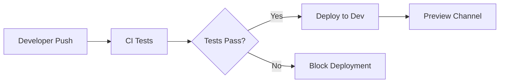
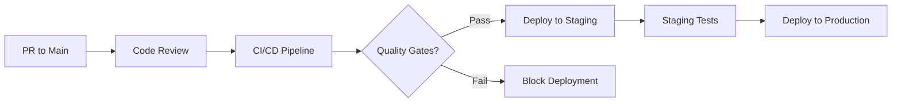

# CI/CD Proposal - Design Patterns Flutter App

## 🎯 **DEPLOYMENT STRATEGY**

### **Platform-Specific Deployment**
| Platform | Primary Method | Backup Method |
|----------|---------------|---------------|
| **Web** 🌐 | Firebase Hosting (GitHub Actions) | Manual Firebase CLI |
| **Android** 🤖 | Google Play Store (future) | Firebase App Distribution |
| **iOS** 🍎 | App Store (future) | Firebase App Distribution |

---

## 🔄 **GITHUB ACTIONS WORKFLOW**

### **Workflow Structure**
```
.github/workflows/
├── ci.yml                 # Continuous Integration
├── deploy-web.yml         # Web deployment to Firebase
├── deploy-mobile.yml      # Mobile app distribution
└── documentation.yml      # Auto-generate docs
```

### **CI Pipeline (`.github/workflows/ci.yml`)**
```yaml
name: 🚀 Continuous Integration

on:
  push:
    branches: [ main, develop ]
  pull_request:
    branches: [ main ]

jobs:
  test:
    name: 🧪 Test Suite
    runs-on: ubuntu-latest
    steps:
      - uses: actions/checkout@v4
      - uses: subosito/flutter-action@v2
        with:
          flutter-version: '3.19.0'
      
      # Run tests with coverage
      - name: 📊 Run Tests with Coverage
        run: |
          flutter test --coverage
          genhtml coverage/lcov.info -o coverage/html
      
      # Upload coverage to Codecov
      - name: 📈 Upload Coverage
        uses: codecov/codecov-action@v3
        with:
          file: coverage/lcov.info

  lint:
    name: 🧹 Code Analysis
    runs-on: ubuntu-latest
    steps:
      - uses: actions/checkout@v4
      - uses: subosito/flutter-action@v2
      
      # Flutter analyze
      - name: 🔍 Analyze Code
        run: flutter analyze --fatal-infos
      
      # Custom lint rules
      - name: 🎯 Custom Pattern Checks
        run: |
          # Check for hardcoded strings
          ! grep -r "hardcoded" lib/ --include="*.dart"
          # Check for proper pattern documentation
          ./scripts/validate_patterns.sh

  security:
    name: 🔒 Security Scan
    runs-on: ubuntu-latest
    steps:
      - uses: actions/checkout@v4
      - name: 🛡️ Run Security Scan
        uses: securecodewarrior/github-action-add-sarif@v1
        with:
          sarif-file: security-scan-results.sarif
```

### **Web Deployment (`.github/workflows/deploy-web.yml`)**
```yaml
name: 🌐 Deploy Web to Firebase

on:
  push:
    branches: [ main ]
  workflow_dispatch:

jobs:
  deploy-web:
    name: 🚀 Deploy to Firebase Hosting
    runs-on: ubuntu-latest
    environment: production
    
    steps:
      - uses: actions/checkout@v4
      - uses: subosito/flutter-action@v2
        with:
          flutter-version: '3.19.0'
      
      # Build web app
      - name: 🏗️ Build Web App
        run: |
          flutter build web --release --web-renderer canvaskit
          
      # Deploy to Firebase
      - name: 🔥 Deploy to Firebase Hosting
        uses: FirebaseExtended/action-hosting-deploy@v0
        with:
          repoToken: '${{ secrets.GITHUB_TOKEN }}'
          firebaseServiceAccount: '${{ secrets.FIREBASE_SERVICE_ACCOUNT }}'
          projectId: design-patterns-flutter-app
          channelId: live
```

### **Mobile Distribution (`.github/workflows/deploy-mobile.yml`)**
```yaml
name: 📱 Mobile App Distribution

on:
  release:
    types: [published]
  workflow_dispatch:

jobs:
  android:
    name: 🤖 Android Build & Distribution
    runs-on: ubuntu-latest
    steps:
      - uses: actions/checkout@v4
      - uses: subosito/flutter-action@v2
      
      # Build Android APK
      - name: 🔨 Build Android APK
        run: flutter build apk --release
      
      # Upload to Firebase App Distribution
      - name: 📦 Distribute Android App
        uses: wzieba/Firebase-Distribution-Github-Action@v1
        with:
          appId: ${{ secrets.FIREBASE_ANDROID_APP_ID }}
          serviceCredentialsFileContent: ${{ secrets.CREDENTIAL_FILE_CONTENT }}
          groups: testers, developers
          file: build/app/outputs/flutter-apk/app-release.apk

  ios:
    name: 🍎 iOS Build & Distribution
    runs-on: macos-latest
    steps:
      - uses: actions/checkout@v4
      - uses: subosito/flutter-action@v2
      
      # Build iOS app
      - name: 🔨 Build iOS App
        run: |
          flutter build ios --release --no-codesign
          
      # Archive and distribute
      - name: 📦 Archive & Distribute iOS
        run: |
          # Custom script for iOS distribution
          ./scripts/distribute_ios.sh
```

### **Documentation Generation (`.github/workflows/documentation.yml`)**
```yaml
name: 📚 Generate Documentation

on:
  push:
    branches: [ main ]
  schedule:
    - cron: '0 2 * * 0'  # Weekly on Sunday

jobs:
  docs:
    name: 📖 Generate & Deploy Documentation
    runs-on: ubuntu-latest
    steps:
      - uses: actions/checkout@v4
      - uses: subosito/flutter-action@v2
      - name: Setup Node.js
        uses: actions/setup-node@v3
        with:
          node-version: '22'
      
      # Install PlantUML
      - name: 🎨 Install Documentation Tools
        run: |
          npm install -g node-plantuml
          
      # Generate all documentation
      - name: 📊 Generate Documentation
        run: |
          chmod +x generate_all_docs.sh
          ./generate_all_docs.sh
          
      # Generate Git history
      - name: 📈 Generate Git History
        run: |
          chmod +x generate_git_log.sh
          ./generate_git_log.sh
          
      # Deploy to GitHub Pages
      - name: 🌐 Deploy Documentation
        uses: peaceiris/actions-gh-pages@v3
        with:
          github_token: ${{ secrets.GITHUB_TOKEN }}
          publish_dir: ./docs
```

---

## 🔥 **FIREBASE CONFIGURATION**

### **Project Setup**
```bash
# Initialize Firebase in project
firebase init

# Select these services:
# ✅ Hosting
# ✅ Functions (for advanced features)
# ✅ Storage Rules
# ✅ Firestore Rules
```

### **Firebase Configuration Files**

**`firebase.json`**
```json
{
  "hosting": {
    "public": "build/web",
    "ignore": [
      "firebase.json",
      "**/.*",
      "**/node_modules/**"
    ],
    "rewrites": [
      {
        "source": "**",
        "destination": "/index.html"
      }
    ],
    "headers": [
      {
        "source": "**/*.@(eot|otf|ttf|ttc|woff|font.css)",
        "headers": [
          {
            "key": "Access-Control-Allow-Origin",
            "value": "*"
          }
        ]
      }
    ]
  },
  "storage": {
    "rules": "storage.rules"
  },
  "firestore": {
    "rules": "firestore.rules",
    "indexes": "firestore.indexes.json"
  }
}
```

**`.firebaserc`**
```json
{
  "projects": {
    "default": "design-patterns-flutter-app",
    "staging": "design-patterns-staging",
    "development": "design-patterns-dev"
  },
  "targets": {
    "design-patterns-flutter-app": {
      "hosting": {
        "production": ["design-patterns-flutter-app"],
        "staging": ["design-patterns-staging"]
      }
    }
  }
}
```

---

## 🌍 **ENVIRONMENT MANAGEMENT**

### **Environment-Specific Configuration**
| Environment | Branch | Firebase Project | URL |
|-------------|--------|------------------|-----|
| **Development** | `develop` | design-patterns-dev | dev.patterns-app.com |
| **Staging** | `staging` | design-patterns-staging | staging.patterns-app.com |
| **Production** | `main` | design-patterns-flutter-app | patterns-app.com |

### **Secrets Management**
```yaml
# Required GitHub Secrets
FIREBASE_SERVICE_ACCOUNT          # Firebase service account key
FIREBASE_ANDROID_APP_ID          # Android app ID
FIREBASE_IOS_APP_ID              # iOS app ID  
CREDENTIAL_FILE_CONTENT          # Firebase credentials for distribution
CODECOV_TOKEN                    # Code coverage token
```

---

## 🔍 **QUALITY GATES**

### **Automated Checks**
- **✅ Unit Tests**: Minimum 80% coverage
- **✅ Widget Tests**: UI component validation
- **✅ Integration Tests**: End-to-end scenarios
- **✅ Code Analysis**: Flutter analyzer with custom rules
- **✅ Security Scan**: Dependency vulnerability check
- **✅ Pattern Validation**: Custom scripts to verify pattern implementation

### **Pre-deployment Requirements**
- All tests passing
- Code coverage above threshold
- Security scan clean
- Performance benchmarks met
- Documentation updated

---

## 📊 **MONITORING & ANALYTICS**

### **Firebase Integration**
- **Performance Monitoring**: Web vitals tracking
- **Crashlytics**: Error reporting and crash analysis
- **Analytics**: User behavior and learning patterns
- **App Check**: Abuse protection

### **GitHub Integration**
- **Status Checks**: Required for merge
- **Branch Protection**: Main branch protected
- **Code Review**: Required before merge
- **Automatic Deployments**: On successful CI

---

## 🚀 **DEPLOYMENT WORKFLOW**

### **Development Flow**


### **Production Flow**


---

## 💡 **ADVANCED FEATURES**

### **Preview Deployments**
- **Feature Branches**: Automatic preview deployments
- **PR Comments**: Deployment links in PR comments
- **Environment Cleanup**: Auto-cleanup of old previews

### **Performance Monitoring**
- **Lighthouse CI**: Performance score tracking
- **Bundle Analysis**: Size optimization monitoring
- **Loading Time**: Performance regression detection

### **Rollback Strategy**
- **Automatic Rollback**: On critical errors
- **Manual Rollback**: Via Firebase console or CLI
- **Health Checks**: Automated monitoring after deployment

---

## 📋 **IMPLEMENTATION CHECKLIST**

### **Phase 1: Basic CI/CD**
- [ ] GitHub Actions setup
- [ ] Firebase project configuration
- [ ] Basic web deployment
- [ ] Test automation

### **Phase 2: Enhanced Features**
- [ ] Mobile app distribution
- [ ] Preview deployments  
- [ ] Performance monitoring
- [ ] Security scanning

### **Phase 3: Production Ready**
- [ ] Multi-environment setup
- [ ] Automated rollbacks
- [ ] Advanced monitoring
- [ ] Documentation automation

---

## 🎯 **SUCCESS METRICS**

### **CI/CD Performance**
- **Build Time**: < 10 minutes
- **Test Execution**: < 5 minutes  
- **Deployment Time**: < 3 minutes
- **Success Rate**: > 95%

### **Quality Metrics**
- **Test Coverage**: > 80%
- **Code Quality**: A grade
- **Security Score**: No high-risk vulnerabilities
- **Performance Score**: > 90 (Lighthouse)

---

## 💰 **COST ESTIMATION**

### **Firebase Hosting**
- **Free Tier**: 10GB storage, 10GB/month transfer
- **Estimated Cost**: $0-25/month depending on traffic

### **GitHub Actions**
- **Free Tier**: 2000 minutes/month
- **Estimated Usage**: ~500 minutes/month
- **Cost**: Free for public repository

### **Additional Services**
- **Codecov**: Free for open source
- **Firebase Services**: Free tier sufficient for development

---

This CI/CD proposal provides a comprehensive, scalable deployment strategy that grows with the project while maintaining high quality and security standards.
