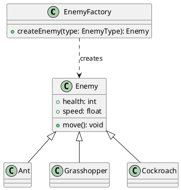
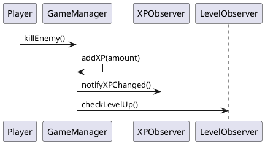
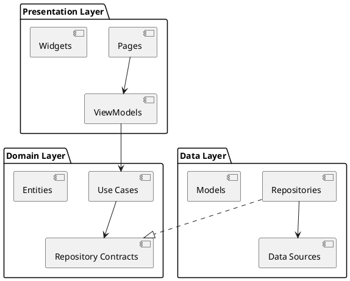

# Documentation Tools - Design Patterns Flutter App

## 📊 RECOMMENDED FREE DOCUMENTATION TOOLS

### 🎯 PRIMARY CHOICE: PlantUML
**Why PlantUML?**
- ✅ Completely FREE and open source
- ✅ Text-based (version control friendly)
- ✅ Supports UML, sequence, class, and architecture diagrams
- ✅ Can be integrated into IDEs and documentation
- ✅ Generates high-quality diagrams

**Installation & Setup:**
```bash
# Install Java (required)
# Windows (using Chocolatey)
choco install openjdk

# Install PlantUML
# Download plantuml.jar from: https://plantuml.com/download
# Or use package manager
npm install -g node-plantuml

# Verify installation
java -jar plantuml.jar -version
```

**Usage Commands:**
```bash
# Generate PNG from .puml file
java -jar plantuml.jar diagram.puml

# Generate SVG (recommended for web)
java -jar plantuml.jar -tsvg diagram.puml

# Watch for changes and auto-generate
java -jar plantuml.jar -gui

# Generate all diagrams in folder
java -jar plantuml.jar "diagrams/*.puml"
```

**VS Code Extension:**
- Install "PlantUML" extension by jebbs
- Preview with `Alt + D`
- Export with `Ctrl + Shift + P` → "PlantUML: Export"

---

## 📐 ALTERNATIVE TOOLS (FREE)

### draw.io (now diagrams.net)
- **Web-based**: https://app.diagrams.net/
- **Desktop app**: Available for all platforms
- **Integration**: Can save to Google Drive, OneDrive, GitHub

**Command for integration:**
```bash
# No command needed - web-based tool
# Can export to various formats (PNG, SVG, PDF)
```

### Mermaid
- **Live Editor**: https://mermaid.live/
- **GitHub Integration**: Native support in GitHub markdown
- **Command line**:
```bash
npm install -g @mermaid-js/mermaid-cli
mmdc -i input.mmd -o output.png
```

---

## 🏗️ DIAGRAM TYPES TO CREATE

### 1. Class Diagrams


### 2. Sequence Diagrams


### 3. Architecture Diagram


---

## 🔄 AUTOMATED DOCUMENTATION GENERATION

### Dart Documentation Commands
```bash
# Generate dartdoc documentation
dart doc

# Generate with custom output directory
dart doc --output docs/api

# Include private members
dart doc --include-source

# Serve documentation locally
dart doc --serve 8080
```

### Complete Generation Script (Node-PlantUML)
Create a script to auto-generate all diagrams and documentation:

**PowerShell Script: `generate_all_docs.ps1`**
```powershell
#!/usr/bin/env pwsh

# Complete Documentation Generator for Design Patterns App
# Generates PlantUML diagrams, pattern graphs, and Dart docs

param(
    [string]$DiagramsPath = "docs/diagrams",
    [string]$OutputPath = "docs/generated", 
    [string]$Format = "svg"
)

Write-Host "🚀 Generating complete documentation..." -ForegroundColor Green

# Create directories if they don't exist
if (-not (Test-Path $DiagramsPath)) { New-Item -Path $DiagramsPath -ItemType Directory -Force }
if (-not (Test-Path $OutputPath)) { New-Item -Path $OutputPath -ItemType Directory -Force }

# Function to generate individual pattern diagram
function Generate-PatternDiagram {
    param($PatternName, $PatternType, $Description)
    
    $pumlFile = "$DiagramsPath/$PatternName.puml"
    $pumlContent = @"
@startuml $PatternName
!theme vibrant
skinparam backgroundColor transparent
skinparam classBackgroundColor #E8F5E8
skinparam classBorderColor #2E7D32

title $PatternName Pattern - Tower Defense Context
note top : $Description

' Pattern implementation will be auto-generated based on context
' This is a template - actual content generated by AI

@enduml
"@
    
    $pumlContent | Out-File -FilePath $pumlFile -Encoding UTF8
    Write-Host "📄 Generated: $pumlFile" -ForegroundColor Cyan
}

# Auto-generate pattern diagrams for each category
Write-Host "📊 Generating Pattern Diagrams..." -ForegroundColor Yellow

# Creational Patterns
Generate-PatternDiagram "FactoryMethod" "Creational" "Enemy and Tower Creation System"
Generate-PatternDiagram "AbstractFactory" "Creational" "Game Element Families (Towers + Projectiles)"
Generate-PatternDiagram "Builder" "Creational" "Map and Evolution Tree Construction"
Generate-PatternDiagram "Prototype" "Creational" "Tower Configuration Cloning"
Generate-PatternDiagram "Singleton" "Creational" "GameManager Instance Control"

# Structural Patterns  
Generate-PatternDiagram "Adapter" "Structural" "Legacy Tower Compatibility"
Generate-PatternDiagram "Bridge" "Structural" "Logic and Rendering Separation"
Generate-PatternDiagram "Composite" "Structural" "Map Hierarchy (Walls, House, Path)"
Generate-PatternDiagram "Decorator" "Structural" "Tower and Projectile Upgrades"
Generate-PatternDiagram "Facade" "Structural" "Game Engine Simplified Interface"
Generate-PatternDiagram "Proxy" "Structural" "Resource Lazy Loading"

# Behavioral Patterns
Generate-PatternDiagram "ChainOfResponsibility" "Behavioral" "Damage Effect Chain Processing"
Generate-PatternDiagram "Command" "Behavioral" "Player Actions and Upgrades"
Generate-PatternDiagram "Mediator" "Behavioral" "Game Component Communication"
Generate-PatternDiagram "Memento" "Behavioral" "Save/Load Game State"
Generate-PatternDiagram "Observer" "Behavioral" "XP and Level Change Notifications"
Generate-PatternDiagram "State" "Behavioral" "Enemy and Player States"
Generate-PatternDiagram "Strategy" "Behavioral" "Interchangeable Behaviors"
Generate-PatternDiagram "TemplateMethod" "Behavioral" "Game Turn Flow Template"

# Generate all PlantUML diagrams
Write-Host "🎨 Converting PlantUML to images..." -ForegroundColor Yellow
Get-ChildItem "$DiagramsPath/*.puml" | ForEach-Object {
    $inputFile = $_.FullName
    $outputFile = "$OutputPath/$($_.BaseName).$Format"
    
    Write-Host "  Converting: $($_.Name)" -ForegroundColor Gray
    node-plantuml $inputFile -o $outputFile -f $Format
    
    if (Test-Path $outputFile) {
        Write-Host "  ✅ Generated: $outputFile" -ForegroundColor Green
    } else {
        Write-Host "  ❌ Failed: $outputFile" -ForegroundColor Red
    }
}

# Generate architecture overview
Write-Host "🏗️ Generating Architecture Diagrams..." -ForegroundColor Yellow
$archPuml = "$DiagramsPath/Architecture_Overview.puml"
$architectureContent = @"
@startuml Architecture_Overview
!theme vibrant

package "Presentation Layer" <<Rectangle>> {
    [Pages] <<UI>>
    [Widgets] <<UI>>  
    [State Management] <<Logic>>
}

package "Domain Layer" <<Rectangle>> {
    [ViewModels] <<Logic>>
    [Use Cases] <<Business>>
    [Entities] <<Model>>
    [Repository Contracts] <<Interface>>
}

package "Data Layer" <<Rectangle>> {
    [Repositories] <<Implementation>>
    [Data Sources] <<External>>
    [Models] <<DTO>>
}

package "External Services" <<Cloud>> {
    [Firebase] <<Service>>
    [SQLite] <<Database>>
    [Device APIs] <<System>>
}

[Pages] --> [State Management]
[State Management] --> [ViewModels]
[ViewModels] --> [Use Cases]
[Use Cases] --> [Repository Contracts]
[Repositories] ..|> [Repository Contracts]
[Repositories] --> [Data Sources]
[Data Sources] --> [Firebase]
[Data Sources] --> [SQLite]
[Data Sources] --> [Device APIs]

note right of [State Management] : Riverpod (Global)\nCubits (Creational)\nBlocs (Structural)\nGetX (Behavioral)

@enduml
"@

$architectureContent | Out-File -FilePath $archPuml -Encoding UTF8
node-plantuml $archPuml -o "$OutputPath/Architecture_Overview.$Format" -f $Format

# Generate Dart documentation
Write-Host "📚 Generating Dart API Documentation..." -ForegroundColor Yellow
try {
    dart doc --output docs/api
    Write-Host "✅ Dart documentation generated" -ForegroundColor Green
} catch {
    Write-Host "⚠️  Dart doc generation skipped (run from project root)" -ForegroundColor Yellow
}

# Summary
Write-Host "`n✅ Documentation generation complete!" -ForegroundColor Green
Write-Host "📂 Pattern diagrams: $OutputPath" -ForegroundColor Cyan
Write-Host "📊 Total diagrams generated: $(Get-ChildItem "$OutputPath/*.$Format" | Measure-Object | Select-Object -ExpandProperty Count)" -ForegroundColor Cyan
Write-Host "📚 API docs: docs/api/index.html" -ForegroundColor Cyan
```

**Bash Script: `generate_all_docs.sh`**
```bash
#!/bin/bash

# Complete Documentation Generator for Design Patterns App
DIAGRAMS_PATH=${1:-"docs/diagrams"}
OUTPUT_PATH=${2:-"docs/generated"}
FORMAT=${3:-"svg"}

echo "🚀 Generating complete documentation..."

# Create directories
mkdir -p "$DIAGRAMS_PATH" "$OUTPUT_PATH"

# Function to generate pattern diagram
generate_pattern_diagram() {
    local pattern_name=$1
    local pattern_type=$2 
    local description=$3
    
    cat > "$DIAGRAMS_PATH/$pattern_name.puml" << EOF
@startuml $pattern_name
!theme vibrant
skinparam backgroundColor transparent
skinparam classBackgroundColor #E8F5E8
skinparam classBorderColor #2E7D32

title $pattern_name Pattern - Tower Defense Context
note top : $description

' Pattern implementation will be auto-generated based on context

@enduml
EOF
    
    echo "📄 Generated: $DIAGRAMS_PATH/$pattern_name.puml"
}

# Generate all pattern templates
echo "📊 Generating Pattern Diagrams..."

# Creational Patterns
generate_pattern_diagram "FactoryMethod" "Creational" "Enemy and Tower Creation System"
generate_pattern_diagram "AbstractFactory" "Creational" "Game Element Families"
generate_pattern_diagram "Builder" "Creational" "Map Construction"
generate_pattern_diagram "Prototype" "Creational" "Configuration Cloning"
generate_pattern_diagram "Singleton" "Creational" "GameManager Control"

# Structural Patterns
generate_pattern_diagram "Adapter" "Structural" "Legacy Compatibility"
generate_pattern_diagram "Bridge" "Structural" "Logic/Rendering Separation"
generate_pattern_diagram "Composite" "Structural" "Map Hierarchy"
generate_pattern_diagram "Decorator" "Structural" "Upgrade System"
generate_pattern_diagram "Facade" "Structural" "Engine Interface"
generate_pattern_diagram "Proxy" "Structural" "Lazy Loading"

# Behavioral Patterns
generate_pattern_diagram "ChainOfResponsibility" "Behavioral" "Effect Processing"
generate_pattern_diagram "Command" "Behavioral" "Player Actions"
generate_pattern_diagram "Mediator" "Behavioral" "Component Communication"
generate_pattern_diagram "Memento" "Behavioral" "Save/Load State"
generate_pattern_diagram "Observer" "Behavioral" "Event Notifications"
generate_pattern_diagram "State" "Behavioral" "Entity States"
generate_pattern_diagram "Strategy" "Behavioral" "Interchangeable Behaviors"
generate_pattern_diagram "TemplateMethod" "Behavioral" "Turn Flow Template"

# Convert all PlantUML to images
echo "🎨 Converting PlantUML to images..."
for puml_file in "$DIAGRAMS_PATH"/*.puml; do
    if [ -f "$puml_file" ]; then
        base_name=$(basename "$puml_file" .puml)
        output_file="$OUTPUT_PATH/$base_name.$FORMAT"
        
        echo "  Converting: $(basename "$puml_file")"
        node-plantuml "$puml_file" -o "$output_file" -f "$FORMAT"
        
        if [ -f "$output_file" ]; then
            echo "  ✅ Generated: $output_file"
        else
            echo "  ❌ Failed: $output_file"
        fi
    fi
done

# Generate Dart documentation
echo "📚 Generating Dart API Documentation..."
if command -v dart &> /dev/null; then
    dart doc --output docs/api 2>/dev/null && echo "✅ Dart documentation generated" || echo "⚠️  Dart doc generation skipped"
else
    echo "⚠️  Dart not found - skipping API documentation"
fi

echo ""
echo "✅ Documentation generation complete!"
echo "📂 Pattern diagrams: $OUTPUT_PATH"
echo "📊 Total diagrams: $(ls -1 "$OUTPUT_PATH"/*.$FORMAT 2>/dev/null | wc -l)"
echo "📚 API docs: docs/api/index.html"
```

**Usage Commands:**
```bash
# PowerShell (Windows)
./generate_all_docs.ps1

# Bash (Linux/macOS)  
chmod +x generate_all_docs.sh
./generate_all_docs.sh

# With custom parameters
./generate_all_docs.sh "my_diagrams" "my_output" "png"
```

---

## 📁 RECOMMENDED FOLDER STRUCTURE

```
docs/
├── diagrams/
│   ├── patterns/           # Individual pattern diagrams
│   ├── architecture/       # System architecture
│   └── sequences/          # Sequence diagrams
├── api/                    # Generated dartdoc
├── generated/              # Generated images from PlantUML
└── README.md              # Documentation index
```

---

## ⚙️ CONFIGURATION FILES

### PlantUML Config (plantuml.config)
```
skinparam backgroundColor transparent
skinparam classBackgroundColor #E1F5FE
skinparam classBorderColor #01579B
skinparam arrowColor #01579B
skinparam sequenceArrowColor #01579B
```

### VS Code Settings
```json
{
  "plantuml.exportFormat": "svg",
  "plantuml.exportSubFolder": "generated",
  "plantuml.exportConcurrency": 3,
  "plantuml.exportMapFile": true
}
```
